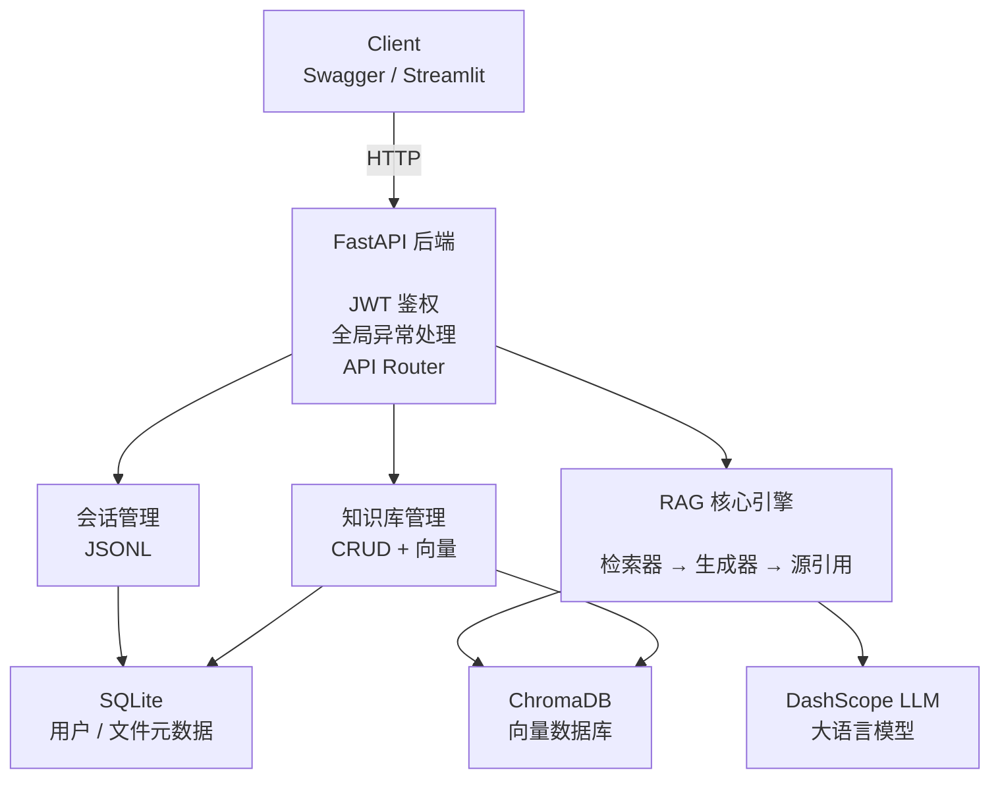

# SmartRAG — 智能知识检索问答系统

基于 **FastAPI + LangChain + ChromaDB** 的 RAG（检索增强生成）系统，支持多轮对话、流式响应、知识库管理与源引用。

## 技术栈

| 层级 | 技术选型 |
|------|---------|
| Web 框架 | FastAPI（异步）+ Uvicorn |
| LLM | 阿里百炼 DashScope（qwen3.7-plus） |
| Embedding | DashScope qwen3.7-text-embedding |
| 向量数据库 | ChromaDB |
| 关系数据库 | SQLite + SQLModel ORM |
| RAG 框架 | LangChain（手动搭链，非高层封装） |
| 认证鉴权 | JWT + bcrypt |
| 依赖管理 | Poetry |
| 日志 | Loguru |
| 测试 | pytest + FastAPI TestClient |

## 系统架构



## 核心特性

### 1. RAG 完整链路
- **文档加载**：支持 TXT / PDF / CSV / JSON 多格式解析
- **智能切分**：RecursiveCharacterTextSplitter，可配置 chunk_size 与 overlap
- **向量化检索**：DashScope Embedding + ChromaDB 相似度搜索
- **历史感知检索**：将对话历史压缩为检索查询，提升多轮对话检索准确性
- **答案生成**：手动构建 LangChain 链（`RunnablePassthrough.assign` + `RunnableBranch`），对底层 API 有完整掌控
- **源引用**：回答附带检索到的上下文来源，支持溯源验证

### 2. 流式响应
- NDJSON（Newline Delimited JSON）格式，逐行推送
- 三种事件类型：`token`（增量文本）、`sources`（引用来源）、`error`（异常信息）
- 流式生成过程中自动保存会话历史

### 3. 会话管理
- 文件持久化（JSONL 格式）+ 内存缓存双写
- 每个用户独立会话空间，自动隔离
- 可配置最大历史轮次（默认 10 轮）

### 4. 知识库管理
- 上传：文件落盘 → 文本提取 → 向量化入库 → 元数据登记
- 列表：按用户隔离展示已上传文档
- 删除：级联删除文件 + 向量数据 + 数据库记录
- 上传者权限控制，用户只能操作自己的文档

### 5. 用户认证
- 注册 → 登录 → JWT → Bearer Token 完整链路
- bcrypt 密码哈希 + HS256 签名
- 接口级鉴权（除注册/登录外全部需要 Token）

## 检索效果评估

基于 **70 条人工标注评估集**（覆盖 5 类金融监管文件、easy / medium / hard 三档难度，含 7 条跨文档对比问题），使用 `Recall@k` 对检索器进行量化评测。

### 评测结果

| 检索策略 | Recall@1   | Recall@2   | Recall@3   |
|---------|------------|------------|------------|
| 向量检索（k=5） | **85.71%** | **100%**   | **100%**   |
| BM25（k=5） | **68.57%** | **85.71%** | **91.43%** |

### 混合检索的取舍

项目实现了 **BM25（jieba 中文分词）+ 向量检索 + RRF 加权融合** 的混合检索链路（`retriever.py`），并单独评测了三者的召回率。

结论：在当前 5 份监管文件的语料规模下，**向量检索已接近饱和（Recall@3 = 100%），混合检索未带来显著增益**。因此：

- 生产链路以向量检索为主，保留混合检索实现，便于语料规模扩大后一键切换
- 评估体系可复现：`cd backend && python evaluation/evaluate_retrieval.py`

> 说明：相比"实现了混合检索"本身，"通过数据证明当前场景不需要混合检索"是更有价值的工程决策——避免为优化而优化。

## 快速开始

### 环境要求

- Python >= 3.11
- Poetry（包管理器）

### 1. 安装依赖

```bash
cd sr
poetry install
```

### 2. 配置环境变量

编辑 `backend/.env`，填入你的阿里百炼 API Key：

```env
ENVIRONMENT=production
SECRET_KEY_ACCESS_API=<你的JWT密钥>
ALGORITHM=HS256
DASHSCOPE_API_KEY=<你的百炼API Key>
DASHSCOPE_BASE_URL=https://llm-vebq3nsnkrdlgvjg.cn-beijing.maas.aliyuncs.com/compatible-mode/v1
```

### 3. 调整 RAG 参数（可选）

`backend/app/config/chat.yaml`：
```yaml
chat:
  llm_model: qwen3.7-plus
  max_history: 10
  save_dir: data/chat_history
```

`backend/app/config/splitter.yaml`：
```yaml
splitter:
  chunk_size: 500
  chunk_overlap: 50
```

### 4. 启动服务

```bash
cd backend
poetry run uvicorn app.main:app --reload --host 0.0.0.0 --port 8000
```

打开浏览器访问：
- Swagger 文档：http://localhost:8000/docs
- ReDoc 文档：http://localhost:8000/redoc

### 5. 运行测试

```bash
cd backend
poetry run pytest test/ -v
```

测试使用独立的 SQLite / Chroma / 文件目录，不会污染生产环境数据。

## API 概览

| 方法 | 路径                      | 说明 | 鉴权 |
|------|-------------------------|------|------|
| POST | `/create`               | 用户注册 | 否 |
| POST | `/login/access-token`   | 登录获取 Token | 否 |
| POST | `/qa/chat`         | 非流式问答 | 是 |
| POST | `/qa/stream_chat`  | 流式问答（NDJSON） | 是 |
| POST | `/documents/upload`     | 上传文档 | 是 |
| GET | `/documents`            | 文档列表 | 是 |
| DELETE | `/documents/{filename}` | 删除文档 | 是 |

### 流式响应格式

```
{"type": "token", "content": "根据"}
{"type": "token", "content": "您"}
{"type": "token", "content": "提供的"}
...
{"type": "sources", "content": [{"source": "doc.txt", "content": "..."}]}
```

## 项目结构

```
sr/
├── README.md
├── pyproject.toml              # Poetry 依赖管理
├── .gitignore
├── poetry.lock
└── backend/
    ├── .env                    # 环境变量（API Key 等）
    ├── app/
    │   ├── main.py             # FastAPI 入口 + lifespan
    │   ├── api/
    │   │   ├── main.py         # 路由聚合
    │   │   └── routes/
    │   │       ├── login.py    # 登录接口
    │   │       ├── create.py   # 注册接口
    │   │       ├── qa.py       # 问答接口（流式 + 非流式）
    │   │       └── documents.py # 知识库 CRUD
    │   ├── core/
    │   │   ├── deps.py         # 依赖注入
    │   │   ├── db.py           # 数据库引擎 + Session
    │   │   ├── settings.py     # 全局配置
    │   │   ├── security.py     # JWT + 密码哈希
    │   │   └── startup.py      # 应用启动初始化
    │   ├── config/
    │   │   ├── chat.yaml       # RAG 参数配置
    │   │   ├── splitter.yaml   # 文本切分配置
    │   │   ├── config_loader.py # YAML 配置加载
    │   │   └── config.py       # Pydantic 配置对象
    │   ├── model/
    │   │   ├── user_model.py   # 用户 ORM
    │   │   └── file_model.py   # 文件 ORM
    │   ├── schema/
    │   │   ├── chat_schema.py  # 问答请求/响应 Schema
    │   │   ├── user_schema.py  # 用户 Schema
    │   │   └── file_schema.py  # 文件 Schema
    │   ├── crud/
    │   │   ├── user_curd.py    # 用户数据库操作
    │   │   └── file_crud.py    # 文件数据库操作
    │   └── rag/
    │       ├── chains.py       # RAG 链构建（检索 + 生成）
    │       ├── documents.py    # 文档加载器
    │       ├── splitter.py     # 文本切分器
    │       ├── vectorstore.py  # 向量数据库操作
    │       ├── memory.py       # 会话记忆管理
    │       ├── retriever.py    # BM25 + RRF 混合检索
    │       └── ingest.py       # 文档入库流水线
    ├── evaluation/             # 检索效果评估
    │   ├── evaluate_retrieval.py # 评估脚本（Recall@k）
    │   └── queries.json        # 70 条标注评估集
    ├── scripts/                # 运维脚本
    │   ├── ingest_knowledge.py # 知识库初始化入库（幂等）
    │   └── reset_rag.py        # 一键重置 RAG 数据
    ├── test/
    │   ├── conftest.py         # pytest 配置 + fixtures
    │   ├── fake_rag.py         # 测试用假 RAG 链
    │   ├── test_auth.py        # 认证测试
    │   ├── test_chat.py        # 问答测试
    │   ├── test_documents.py   # 知识库测试
    │   └── test_memory.py      # 会话隔离测试
    └── data/                   # 运行时数据（自动生成）
        ├── SQLite/             # SQLite 数据库文件
        ├── chroma/             # ChromaDB 向量数据
        ├── knowledge/          # 上传的原始文档
        └── chat_history/       # 会话历史文件
```

## 设计决策

| 决策 | 原因 |
|------|------|
| 手动构建 LangChain 链 | 方便理解底层原理和定制化调试，比 `create_retrieval_chain` 封装更灵活 |
| 文件级会话持久化 | 无需引入 Redis，轻量且满足当前规模 |
| 测试用 FakeRagChain | 测试不依赖 LLM API，速度快且稳定 |
| YAML + .env 混合配置 | YAML 管业务参数，.env 管密钥，职责分离 |
| `RunnableBranch` 区分有无历史 | 无历史走纯检索链，避免空历史污染检索查询 |
